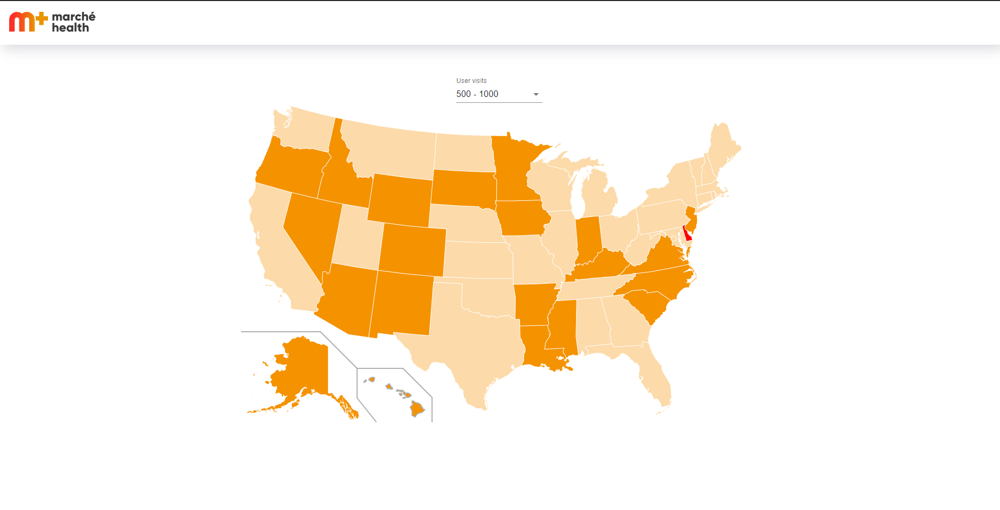

👋 Hello!

💻 Application: https://marche-health.netlify.app/

👨‍💻 How to run the application?

Run:

1. ### `npm install`
2. When everything will be installed then move to another step
3. ### `npm start`
4. ### `npm run start:backend`

The application should be running on your default browser. Have fun! 😀

